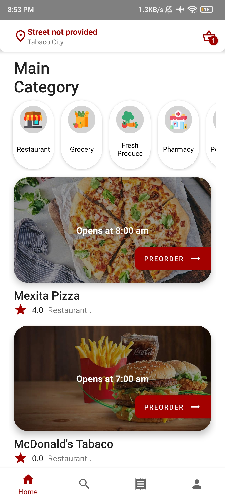
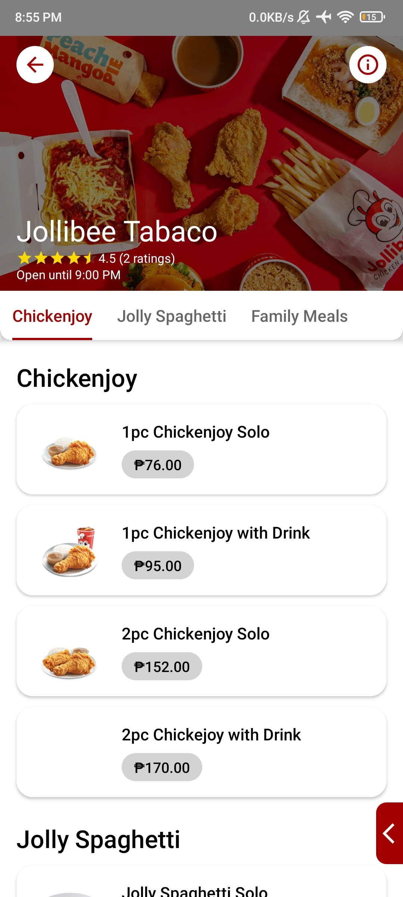
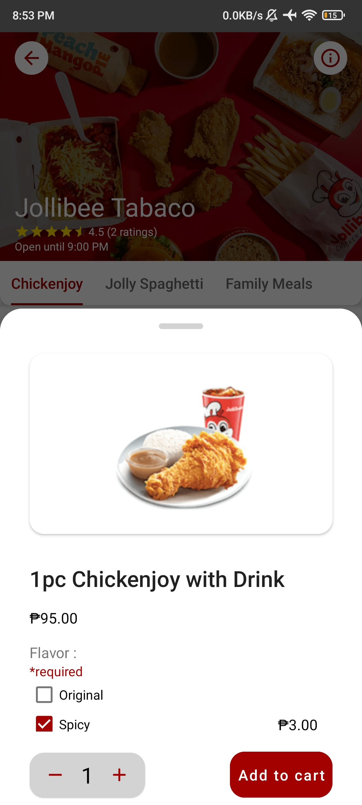
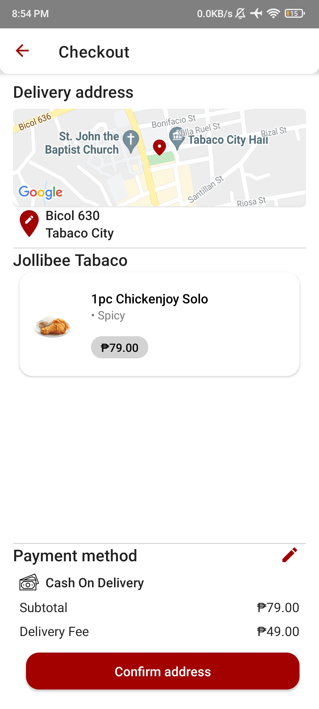

# Food And Grocery Delivery App

   

Android application developed in Android Studio using Kotlin, Data Binding, View Binding, ViewModel, LiveData, Kotllin Coroutines, Navigation component, Firebase, Hilt together with the MVVM architecture pattern.
